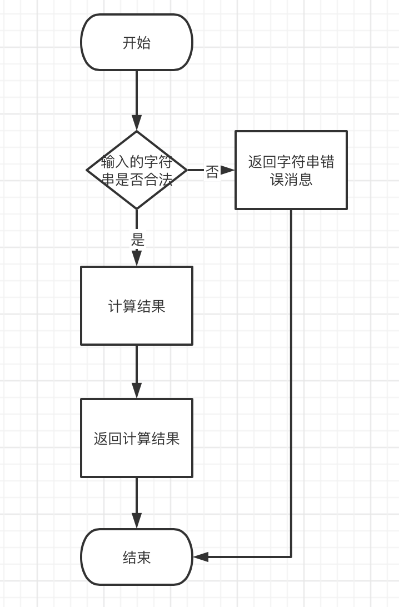

#计算器

#整体框架
```
使用Gin框架完成一个接口：请求参数一个字符串，包含正整数、加(+)、减(-)、
乘(*)、除(/)的算数表达式(括号除外)，返回表达式的计算结果。表达式仅包含
非负整数， +， - ，*，/ 四种运算符和空格 。 整数除法仅保留整数部分。
```

#目录结构
```
.
├── PreTest                             #压力测试
│   ├── calculator.py
│   └── report_calculator.html
├── README.md                           #介绍
├── calculator_test.go                  #单元测试
├── ctrl                                #请求参数验证，构造回复的信息
│   └── routerCtrl.go
├── go.mod
├── handle                              
│   └── handle.go                       #处理具体的业务逻辑
├── main.go
├── module                                         
│   └── stack.go                        #实现数据结构栈
├── picture
│   └── flowchat.png                    #流程图
├── router
│   └── router.go                       #路由转发
└── service
    └── calculator.go                   #实现计算逻辑，验证字符串

```


#代码逻辑分层  calculator
| 层     | 文件夹|主要职责 |调用关系|
| :----: | :----|:---- | :-----|
|router  | /router|路由转发|调用ctrl|
|ctrl    |/ctrl | 请求参数验证，处理请求后构造回复消息|调用handle|
|handle  | /handle|处理具体业务逻辑 |调用service|
|service | /service|处理通用逻辑 实现计算逻辑，验证字符串 |被handle调用 |
|module  | /stack | 数据结构stack | 被service调用|

#接口设计
```
接口地址 
/C1/calculator 
```
### 请求方式
GET
### 请求示例
```
http://127.0.0.1:9000/C1/calculator?exp=3+3*4/2
```

### 参数  说明

``` 
exp 类型 string 输入需要一个字符串包含正整数、加(+)、减(-)、乘(*) 、除(/)的算数表达式(括号除外) 
```

```
成功示例 
{
  "condition":"pass",
  "result":9
} 
错误示列 
{
  "condition":"error",
  "result":"exp error"
}
```

#第三方库
```
github.com/gin-gonic/gin  开发框架
```

#流程图
